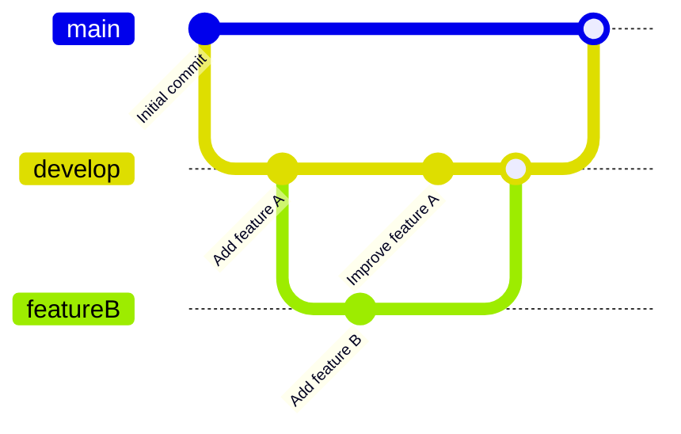

### 📊 Git Workflow

```mermaid
gitGraph
   commit id: "Initial commit"
   branch develop
   checkout develop
   commit id: "Add feature A"
   branch featureB
   checkout featureB
   commit id: "Add feature B"
   checkout develop
   commit id: "Improve feature A"
   merge featureB
   checkout main
   merge develop
```
